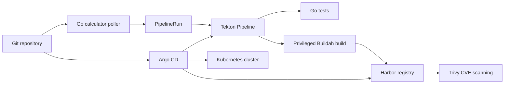

# GitOps CI/CD Platform for Kubernetes

An end-to-end, Git-driven CI/CD platform for building, scanning, storing, and deploying containerized applications on Kubernetes.

This project demonstrates a production-minded delivery workflow built from open-source components. Infrastructure and application configuration are managed declaratively in Git, Argo CD continuously reconciles the cluster, Tekton executes repeatable build pipelines, and Harbor provides a private registry with vulnerability scanning through Trivy.

## Demo

> **Video walkthrough:** _Add a project demo recording here._
>
> Suggested recording: show a version change in Git, the poller detecting it, the Tekton PipelineRun, Buildah building the image, Harbor scanning and storing the artifact, and Argo CD presenting the resulting application state.

## What This Project Does

The platform monitors the application repository for new releases. When a new version is detected, a Kubernetes-native pipeline is created automatically. The pipeline clones the requested Git revision, runs tests, builds the Go application into a container image, pushes both a versioned and `latest` tag to Harbor, and makes the artifact available for downstream deployment workflows.

The design separates normal platform operations from privileged image-building workloads. Tekton controllers and the poller remain in the restricted `tekton-pipelines` namespace, while Buildah runs in the dedicated `tekton-privileged` namespace with Pod Security `privileged` enabled. This keeps the elevated build boundary explicit and limits privileged execution to the workload that requires it.

## Architecture



## Core Components

| Component | Responsibility |
| --- | --- |
| **Argo CD** | GitOps reconciliation, automated sync, pruning, and self-healing |
| **Tekton Pipelines** | Kubernetes-native Tasks, Pipelines, TaskRuns, and PipelineRuns |
| **Buildah** | Rootful container image builds in the isolated privileged namespace |
| **Harbor** | Private image registry, persistent artifact storage, and registry API |
| **Trivy** | Vulnerability scanning for images stored in Harbor |
| **Ansible** | Argo CD bootstrap and repeatable cluster installation |
| **Make** | Local developer entry points for setup, teardown, and poller image publishing |
| **Go calculator** | Example application used to exercise the delivery workflow |

## Delivery Workflow

1. A new application version is committed to the Git repository.
2. The `go-calculator-poller` CronJob checks the repository revision and version.
3. The poller creates a `PipelineRun` in `tekton-privileged` using the `go-calculator-pipeline` ServiceAccount.
4. Tekton clones the requested revision and runs the Go test Task.
5. Buildah builds the image with version and revision labels.
6. The image is pushed to Harbor with both a versioned tag and `latest`.
7. Harbor and Trivy provide centralized artifact storage and vulnerability visibility.
8. Argo CD continuously reconciles the declarative state from Git and exposes drift through its UI.

## Repository Layout

```text
ansible/              Argo CD installation playbooks and roles
argocd/               Argo CD Applications and GitOps entry point
go-calculator/        Example Go application and container definition
harbor/               Harbor configuration resources
tekton/               Tekton controller, dashboard, and feature configuration
tekton-pipelines/     Restricted namespace: poller CronJob and RBAC
tekton-privileged/    Privileged namespace: Tasks, Pipeline, registry secret, and RBAC
tekton-poller/        Poller container source and Dockerfile
Makefile              Local setup and operational commands
```

## Technical Details

- **Declarative operations:** Kubernetes resources, Tekton definitions, Argo CD Applications, and environment configuration are versioned in Git.
- **Namespace isolation:** `tekton-pipelines` remains restricted; only image-building workloads run in `tekton-privileged`.
- **Cross-namespace RBAC:** The poller ServiceAccount is defined in `tekton-pipelines` and is granted narrowly scoped PipelineRun permissions in `tekton-privileged` through a RoleBinding in that namespace.
- **Build reproducibility:** Pipeline parameters capture the Git URL, immutable revision, application version, image repository, and build context.
- **Artifact traceability:** Images include OCI labels for the application version and Git revision.
- **Registry authentication:** Harbor credentials are mounted into the Buildah Task through a Kubernetes Docker configuration Secret.
- **Persistent infrastructure:** Harbor registry, database, Redis, job logs, and Trivy data use persistent volume claims.
- **Automated reconciliation:** Argo CD applications use automated sync, pruning, and self-healing to keep the cluster aligned with Git.
- **Security boundaries:** Poller pods run as non-root with dropped capabilities and a runtime-default seccomp profile; privileged access is limited to the Buildah build step.

## Local Setup

The repository is designed for a local Kubernetes workflow and can be bootstrapped with Kind, Ansible, and Argo CD.

```bash
make full-setup
```

Useful commands:

```bash
make kind-cluster     # Create the local Kind cluster
make argo             # Install Argo CD and bootstrap the root application
make poller-push      # Build and publish the poller image
make clean-kind       # Delete the local cluster
make argo-clean       # Remove the Argo CD installation
```

After Argo CD is available, the root Application discovers the Git-managed Applications under `argocd/applications`. Harbor, Tekton, the poller, and the privileged build resources can then be reconciled from the repository rather than configured manually with imperative commands.

## Design Notes and Next Steps

This repository is a portfolio-scale implementation of a production-style platform. The next hardening steps would be to move credentials to an external secret manager, enable Harbor TLS, replace polling with an event-driven webhook, add promotion gates for development, staging, and production, and make version/image reconciliation query Harbor directly before scheduling a build.

## License

This repository is intended as a technical demonstration and portfolio project.
